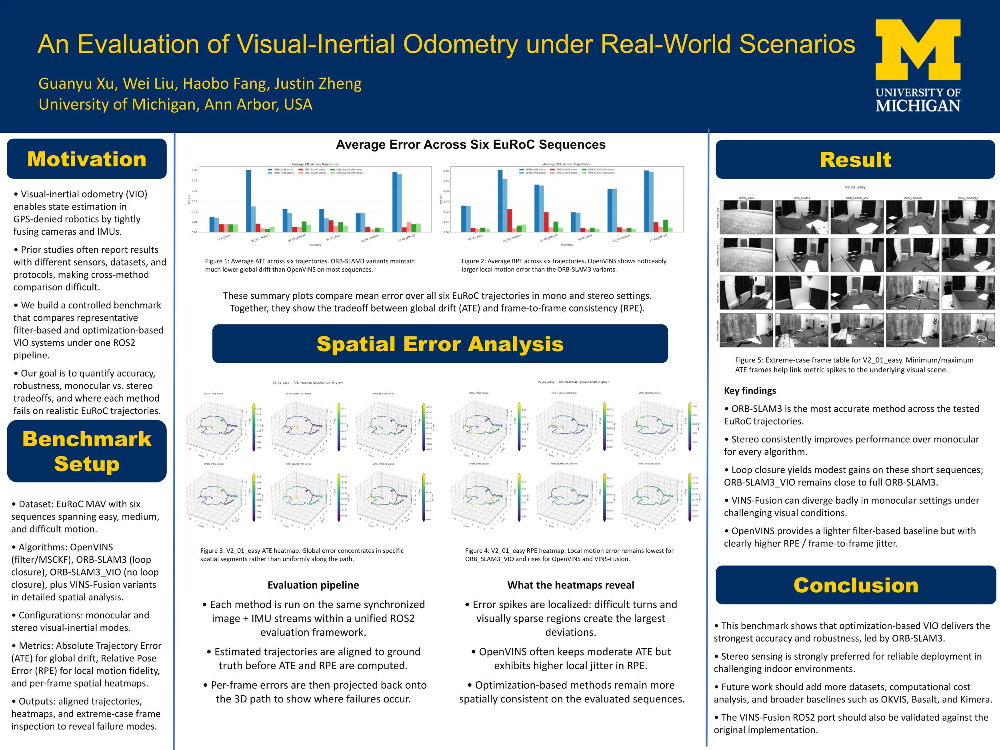

# Python VINS-Fusion for ROS2

This repository contains a Python implementation of VINS-Fusion running on ROS2. The evaluation script is included in the ```scrip/``` folder. Further detailed are described in our [presentation](https://youtu.be/Gr1ZjeuqnIY).


*Demo of vins fusion, visualized in RViz2 using EuRoC MAV dataset (Vicon Room1 Medium).*



## Requirements

- ROS2 with `rclpy`, `cv_bridge`, `tf2_ros`, `sensor_msgs`, `nav_msgs`, and `geometry_msgs`
- Python 3.10+
- `uv`

Source ROS2:

```bash
source /opt/ros/<ros2-distro>/setup.bash
```

## Install Python Dependencies

From the repository root:

```bash
uv sync
```

## Build The ROS2 Python Packages

```bash
colcon build --symlink-install
```

Source the overlay:

```bash
source install/setup.bash
```

## Run VINS

Run the estimator directly:

```bash
ros2 run vins vins_node config/euroc/euroc_stereo_imu_config.yaml
```

Or launch it:

```bash
ros2 launch vins vins.launch.py \
  config_path:=config/euroc/euroc_stereo_imu_config.yaml
```

Other useful configs:

```bash
ros2 run vins vins_node config/euroc/euroc_mono_imu_config.yaml
ros2 run vins vins_node config/euroc/euroc_stereo_config.yaml
ros2 run vins vins_node config/realsense_d435i/realsense_stereo_imu_config.yaml
```

## Run Loop Fusion

Start VINS first, then in another terminal:

```bash
cd /media/weiliu/SSD/code/vins_fusion_ros2
source /opt/ros/jazzy/setup.bash
source install/setup.bash

ros2 run vins_loop_fusion loop_fusion_node config/euroc/euroc_stereo_imu_config.yaml
```

## Convert ROS1 Bags

If your dataset is still in ROS1 bag format:

```bash
uv pip install rosbags
rosbags-convert /path/to/input.bag --dst /path/to/output_ros2
```

Then play the converted ROS2 bag:

```bash
ros2 bag play /path/to/output_ros2
```

For normal ROS2 usage, prefer the `colcon build` and `ros2 run` workflow above.

## Baseline Systems

In addition to our ROS2-based implementation of VINS-Fusion, we have evaluated and replicated several baseline systems for comprehensive comparison:

- **OpenVINS**
- **ORB-SLAM3**
- **ORB-SLAM3_VIO**: To isolate the effect of loop closure and map reuse in optimization-based pipelines, we constructed an odometry-only variant of ORB-SLAM3. In this variant, loop detection and relocalization functionalities are explicitly disabled by modifying the source code such that map reuse detection and relocalization routines always return `false`. As a result, the system operates purely as a visual-inertial odometry estimator without global pose graph optimization. This controlled modification enables a direct comparison between full SLAM and odometry-only configurations under identical front-end and optimization back-end structures. For full details and the modified implementation, please refer to the `orb_slam3_vio` branch.

### Evaluation

The specific scripts and calculation procedures for evaluating trajectory metrics, such as Absolute Trajectory Error (ATE) and Relative Pose Error (RPE), are located in the `eval` folder of the `main` branch.


